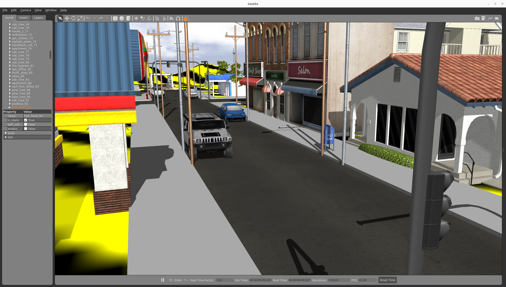
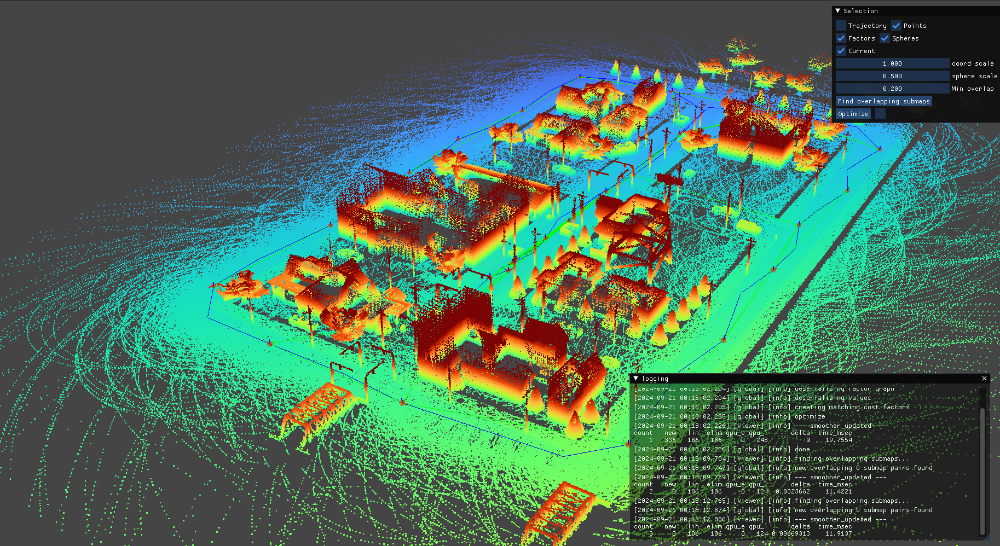
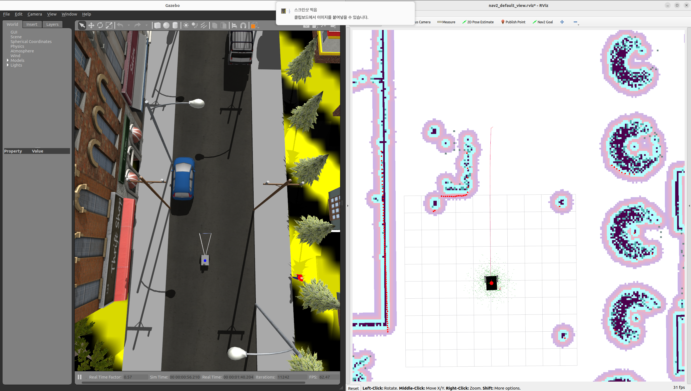

# RDSim: Robo Delivery Simulator





## Environment Settings
### i) local: Install && build

* Setting GAZEBO_RESOURCE_PATH
```sh
echo "export GAZEBO_RESOURCE_PATH=/usr/share/gazebo-11:$GAZEBO_RESOURCE_PATH" >> ~/.bashrc
source ~/.bashrc
```

* RDSim build
```bash
$ cd ~/ros2_ws/src 
$ git clone --recursive https://github.com/AuTURBO/RDSim.git
$ sudo rosdep install --ignore-src --rosdistro humble --from-paths ./src/RDSim/rdsim_submodules/navigation2
$ cd ~/ros2_ws/src/RDSim/gazebo_sfm_plugin/lightsfm && make && sudo make install
$ cd ~/ros2_ws && colcon build --symlink-install && source install/local_setup.bash
```

* Install dependency
```bash
$ sudo apt-get update
$ sudo apt install ros-humble-robot-localization -y
$ sudo apt install ros-humble-imu-filter-madgwick -y
$ sudo apt install ros-humble-controller-manager -y
$ sudo apt install ros-humble-controller-manager -y
$ sudo apt install ros-humble-diff-drive-controller -y
$ sudo apt install ros-humble-imu-filter-madgwick -y
$ sudo apt install ros-humble-interactive-marker-twist-server -y
# jackal-description 패키지는 아래의 추가 사항 참고
$ sudo apt install ros-humble-joint-state-broadcaster -y
$ sudo apt install ros-humble-joint-trajectory-controller -y
$ sudo apt install ros-humble-joint-state-publisher-gui -y
$ sudo apt install ros-humble-joy -y
$ sudo apt install ros-humble-robot-localization -y
$ sudo apt install ros-humble-robot-state-publisher -y
$ sudo apt install ros-humble-teleop-twist-joy -y
$ sudo apt install ros-humble-twist-mux -y
$ sudo apt-get install libgazebo-dev
# Naivigation
$sudo apt install ros-humble-spatio-temporal-voxel-layer -y
# localization 
$ sudo apt-get install ros-humble-pcl-ros -y
$ sudo apt install ros-humble-pcl-conversions -y
$ sudo apt install ros-humble-rclcpp-components -y


```

### ii) docker

> Docker environment tested on Ubuntu 22.04, nvidia
> 

```bash
# in rdsim main directory
cd ~/ros2_ws/src/RDSim/docker && ./run_command.sh 
```

## Execute RDSim
### Gazebo world launch

> Gazebo 맵만 실행시킬 경우
> 

```bash
ros2 launch rdsim_gazebo rdsim_gazebo_world.launch.py  
```

### Robot Display launch 

> Gazebo 없이 로봇의 tf를 확인하고 싶을 경우
> 

```bash
ros2 launch rdsim_description rdsim_description.launch.py 
```


---

### Sim launch

```bash
ros2 launch rdsim_description rdsim_gazebo.launch.py 
```

### teleop cmd 

> cmd_vel을 통해 제어하기 때문에 다음 명령어를 통해 제어할 수 있습니다.
> 

```bash
ros2 run teleop_twist_keyboard teleop_twist_keyboard
```
