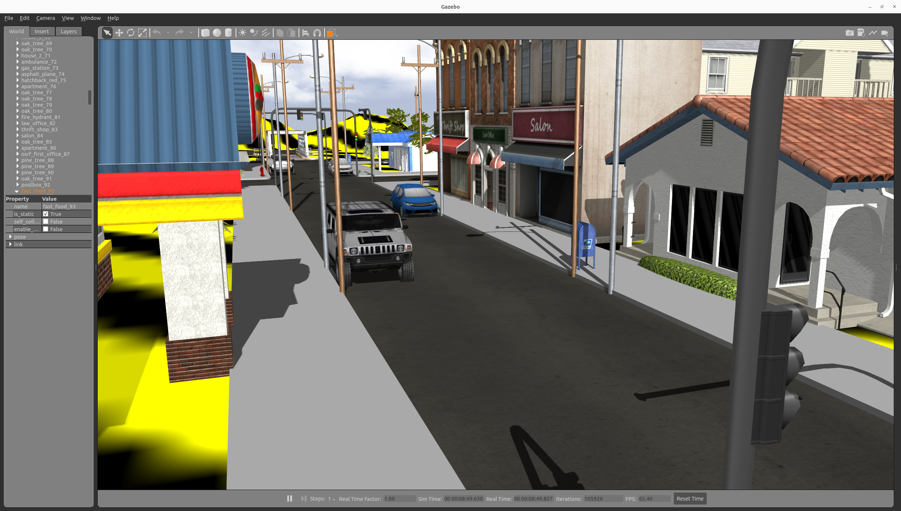

## RDSim 



### Install && build

```bash
cd ~/ros2_ws/src 
git clone https://github.com/AuTURBO/RDSim.git
cd ~/ros2_ws && colcon build --symlink-install && source install/local_setup.bash
```

```bash
sudo apt-get update
sudo apt install ros-humble-robot-localization
sudo apt install ros-humble-imu-filter-madgwick
sudo apt install ros-humble-controller-manager
sudo apt install ros-humble-controller-manager
sudo apt install ros-humble-diff-drive-controller
sudo apt install ros-humble-imu-filter-madgwick
sudo apt install ros-humble-interactive-marker-twist-server
# jackal-description 패키지는 아래의 추가 사항 참고
sudo apt install ros-humble-joint-state-broadcaster
sudo apt install ros-humble-joint-trajectory-controller
sudo apt install ros-humble-joy
sudo apt install ros-humble-robot-localization
sudo apt install ros-humble-robot-state-publisher
sudo apt install ros-humble-teleop-twist-joy
sudo apt install ros-humble-twist-mux
```

### Sim launch

```bash
ros2 launch rdsim_description rdsim_gazebo.launch.py 
```

### Jackal Controller launch

```bash
ros2 launch jackal_control control.launch.py 
```

### Jackal cmd 2 teleop cmd

```bash
ros2 launch jackal_control teleop_base.launch.py 
```