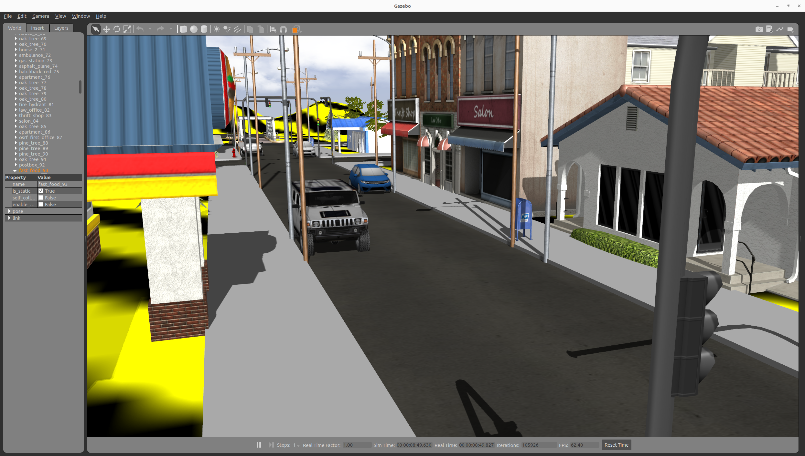
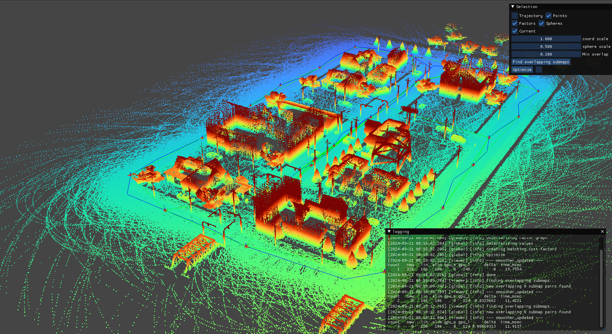
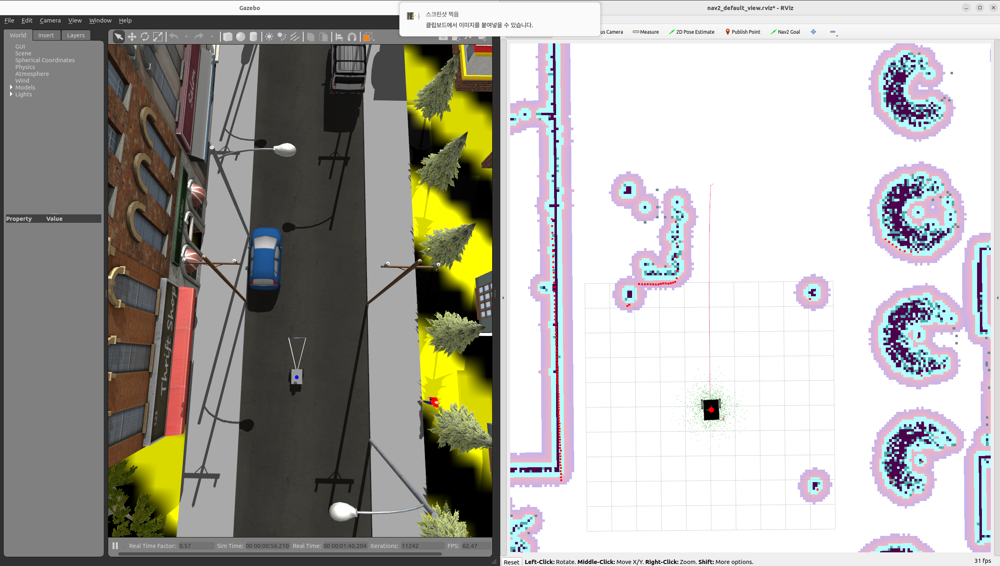
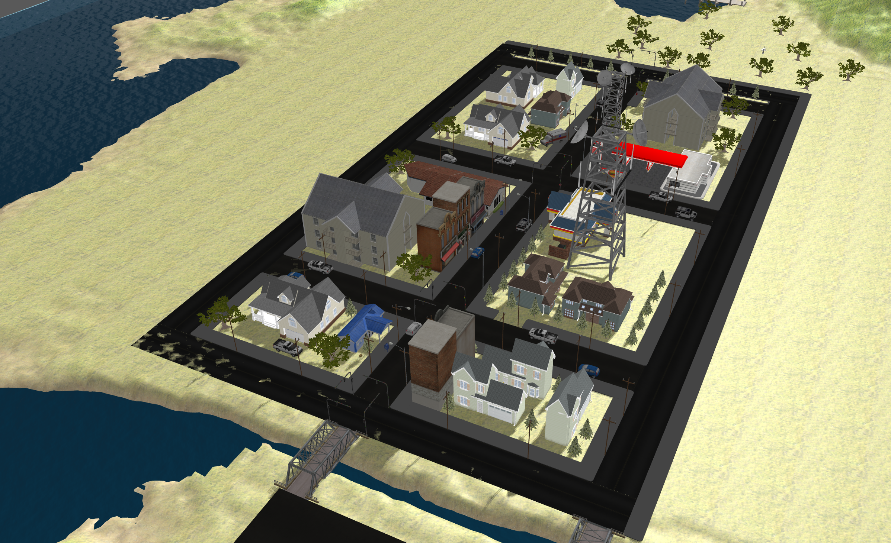
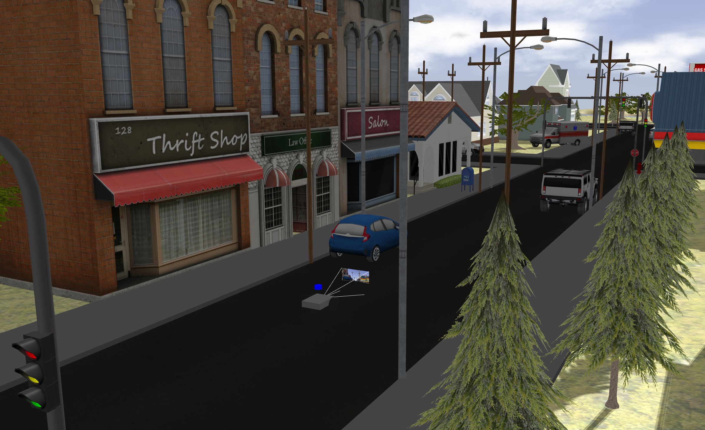
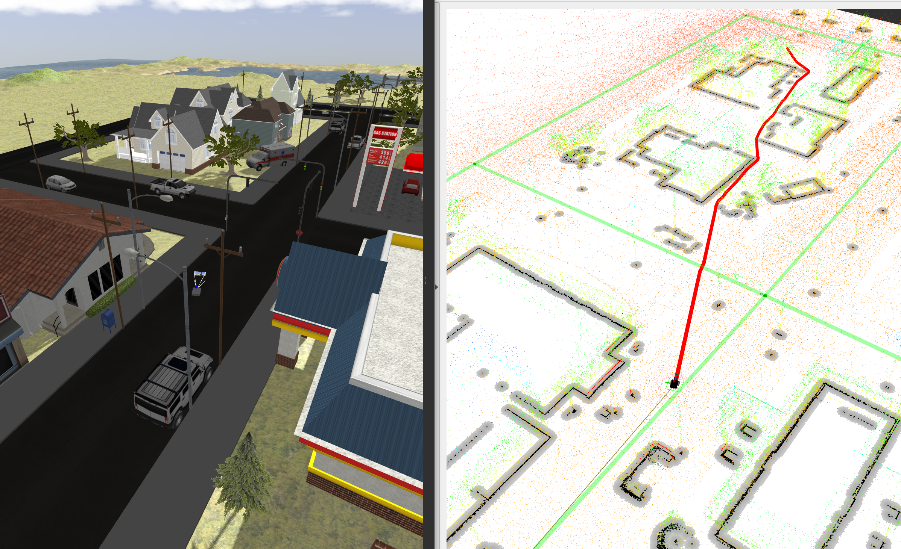
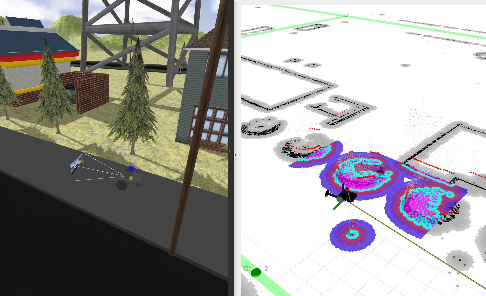
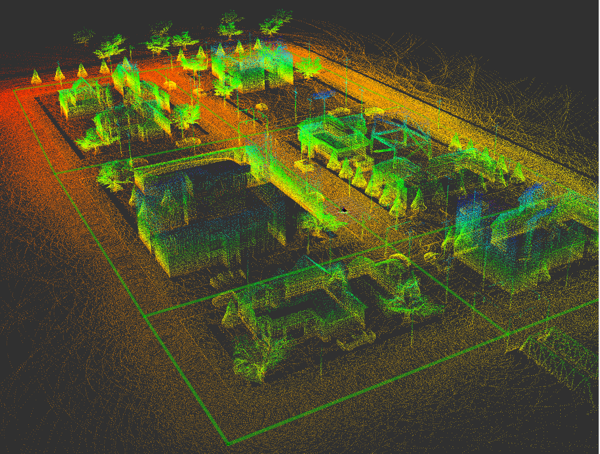
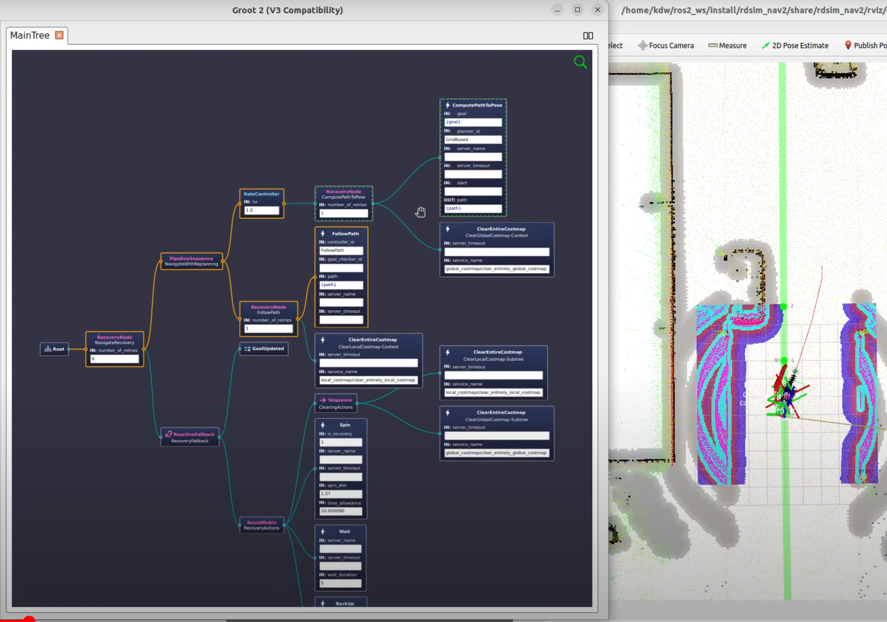
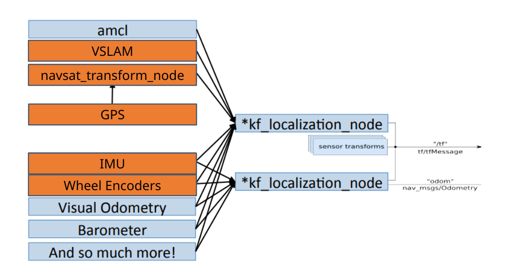

# RDSim: Robo Delivery Simulator

### [Project Page](https://auturbo.github.io/RDSim) | [Video](https://www.youtube.com/watch?si=KmcLMo9WP7M93-m2&v=LW87tunwvLI&feature=youtu.be)

<b>Summary:</b>
*RDSim is a Robo Delivery Simulator developed for autonomous delivery systems. It integrates state-of-the-art SLAM, localization, planning, and control technologies within the Gazebo simulation environment. Designed as a comprehensive solution, RDSim supports robot control, environment simulation, and robust navigation capabilities.*

<div style="display: flex; justify-content: center;">
  
  
  
</div>

## 1. Environment Settings
There are two ways to execute: 'Manual Installation && build' or 'Docker Installation'


**RDSim clone**

First of all, we need to clone this project before that.

```bash
$ cd ~/ros2_ws/src
$ git clone --recursive https://github.com/AuTURBO/RDSim.git
$ cd ~/ros2_ws/src/RDSim/ && git submodule update --remote
```

### 1.1. Manual Installation && build

**Requirements**
- [ROS 2 humble](https://docs.ros.org/en/humble/index.html)
- [gazebo 11](https://classic.gazebosim.org/tutorials?tut=install_ubuntu)


**Setting GAZEBO_RESOURCE_PATH**
```sh
echo "export GAZEBO_RESOURCE_PATH=/usr/share/gazebo-11:$GAZEBO_RESOURCE_PATH" >> ~/.bashrc
source ~/.bashrc
```

**Install dependency**
```bash
$ sudo apt-get update && sudo apt install -y \
    ros-humble-robot-localization \
    ros-humble-imu-filter-madgwick \
    ros-humble-controller-manager \
    ros-humble-diff-drive-controller \
    ros-humble-interactive-marker-twist-server \
    ros-humble-joint-state-broadcaster \
    ros-humble-joint-trajectory-controller \
    ros-humble-joint-state-publisher-gui \
    ros-humble-joy \
    ros-humble-robot-state-publisher \
    ros-humble-teleop-twist-joy \
    ros-humble-twist-mux \
    libgazebo-dev \
    ros-humble-spatio-temporal-voxel-layer \
    ros-humble-pcl-ros \
    ros-humble-pcl-conversions \
    ros-humble-rclcpp-components \
    ros-humble-xacro* \
    tmux \
    tmuxp \
    && echo 'alias start_rdsim="cd ~/ros2_ws/src/RDSim/rdsim_launcher && tmuxp load rdsim_launcher.yaml"' >> ~/.bashrc \
    && echo 'alias end="tmux kill-session && killgazebo"' >> ~/.bashrc \
    && source ~/.bashrc
```

**RDSim build**
```bash
$ cd ~/ros2_ws && rosdep install --ignore-src --rosdistro humble --from-paths ./src/RDSim/rdsim_submodules/navigation2
$ cd ~/ros2_ws && colcon build --symlink-install --parallel-workers 8 && source install/local_setup.bash
```

### 1.2. Docker Installation

> Docker environment tested on Ubuntu 22.04, nvidia
>

```bash
# in rdsim main directory
cd ~/ros2_ws/src/RDSim/docker && ./run_command.sh
# in docker container
cd ~/ros2_ws && colcon build --symlink-install --parallel-workers 8 && source install/local_setup.bash
```

## 2. Executing the RDSim with One Line
### Launch All Nodes
To start the simulation and launch all necessary nodes, simply execute the following command:

```bash
start_rdsim
```
This command initializes the RDSim environment and starts all relevant processes automatically.

### Terminate All Nodes

To terminate all running nodes and clean up resources, use the following

```bash
end
```

This command ensures that all processes related to the simulation are safely stopped.


## 3. Launch the ROS2 Nodes and GAZEBO world

### Launch the Gazebo world

```bash
ros2 launch rdsim_gazebo rdsim_gazebo_world.launch.py
```


<div style="display: flex; justify-content: center;">
  
</div>


---

### Loading the robot model into the GAZEBO world

```bash
ros2 launch rdsim_description rdsim_gazebo.launch.py
```

<div style="display: flex; justify-content: center;">
  
</div>

### Teleoperate the robot

Executing the teleoperation node to control the robot via keyboard input

```bash
ros2 run teleop_twist_keyboard teleop_twist_keyboard
```

### Navigate the outdoor robot in the GAZEBO world


The system supports launching localization nodes (VSLAM, EKF) and the navigation node (NAV2) for outdoor environments.


```bash
ros2 launch rdsim_gazebo rdsim_gps_navigation.launch.py
```

<div style="display: flex; justify-content: center;">
  
</div>


This Navigation can detect 3D obstacles, such as trees, using a 3D LiDAR sensor and a spatio-temporal voxel layer for precise obstacle avoidance.

<div style="display: flex; justify-content: center;">
  
</div>

The topology map can be generated using the rdsim_submodules/RDSim_GUI package. It can be run with Python, and nodes and edges can be created and modified through mouse clicks on the web interface.

```bash
cd rdsim_submodules/RDSim_GUI
python3 main.py
```

This navigation module includes a new topology map server that supports predefined routing plans for efficient delivery in the GAZEBO simulation environment. The topology map server is implemented as a behavior, enabling the use of behavior trees for flexible and adaptive decision-making. Additionally, the behavior tree can be visualized using Groot for better understanding and debugging.

<div style="display: flex; justify-content: center;">
  
  
</div>


By sending the send_gal action in ROS 2, a path is generated along the edges from the starting point to the destination using a topology map. The status of the Behavior Tree (BT) nodes can be monitored in real-time through Groot.

```bash
ros2 action send_goal /navigate_to_topology nav2_msgs/action/NavigateToTopology "start_vertex_id: 0
end_vertex_id: 1
behavior_tree: ''" -f
```

[](https://youtu.be/TnKT1lYnIRw?si=Yi2XdAiFbo_Gp94S)


> The localization framework is based on pose estimation using the `robot_localization` package. It integrates data from various sensors, including:
> - 3D Lidar SLAM (HDL Localization) module
> - GPS sensor
> - Wheel odometry
> - IMU sensor

<div style="display: flex; justify-content: center;">
  
</div>

_* The box represented in orange is used_
